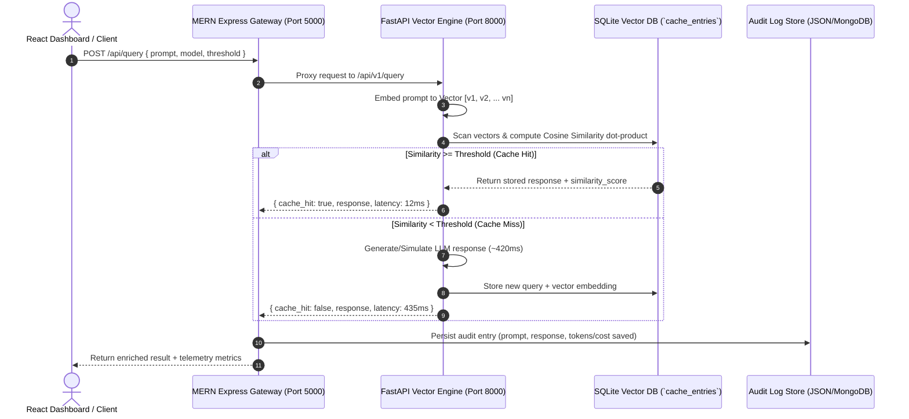

# Technical Implementation Plan: LLM Semantic Cache (MERN + FastAPI Hybrid Architecture)

An enterprise-grade, hybrid **Semantic Caching Engine** designed to dramatically reduce Large Language Model (LLM) latency and API costs. By combining **FastAPI (Python)** for vector embedding computation and float32 cosine similarity indexing with a **MERN Stack (MongoDB, Express, React, Node.js)** gateway and dashboard, the system achieves sub-15ms cache retrieval for semantically equivalent queries.

---

## 1. Core Problem & Solution

### The Problem with Exact String Caching
Traditional caching engines (Redis exact-key lookups) fail for natural language applications because users express the same intent using different phrasing:
- Query A: *"How do I sort a list in Python?"*
- Query B: *"What is the best way to sort a list in Python?"*
- Query C: *"Sort Python list examples"*

Exact string matching treats these as three separate cache misses, calling the expensive LLM API every time (`~400-800ms` latency, plus token costs).

### The Semantic Cache Solution
Instead of string matching, the Semantic Cache converts prompts into **High-Dimensional Vector Embeddings (`[float32, ...]`)** and compares them using **Cosine Dot-Product Similarity**.
When Query B arrives, its vector is compared against stored vectors. If `Cosine Similarity >= threshold (e.g., 0.68 - 0.85)`, the system recognizes conceptual equivalence and immediately returns Query A's cached response—saving 100% of LLM tokens and reducing latency by >95%.

---

## 2. System Architecture & Request Lifecycle

---

## 3. Component Breakdown & Design Decisions

### A. Python FastAPI Core Vector Engine (`fastapi_service/`)
- **`embeddings.py` (Zero-Dependency Vectorizer & ML Providers)**:
  - **`FastLocalVectorizer`**: An innovative pure-Python implementation (with optional NumPy acceleration) that computes character 3-grams, word unigrams/bigrams, and hashes them into a normalized `384-dimensional float vector`. This guarantees instant, zero-dependency execution across any environment without heavy ML wheel downloads (`PyTorch`/`SentenceTransformers`).
  - **`LocalSentenceTransformerProvider`**: Supports deep learning semantic embeddings using `all-MiniLM-L6-v2` (`384-dim`) when installed.
  - **`OpenAIEmbeddingProvider`**: Supports remote `text-embedding-3-small` (`1536-dim`).
- **`storage.py` (Binary Vector Index & SQLite Store)**:
  - Stores vectors packed as binary IEEE 754 float32 (`struct.pack("384f", *vec)`).
  - Performs fast vector dot-product scanning: `score = sum(u[i] * v[i])`. Because vectors are L2-normalized on ingestion (`||v|| = 1`), the dot product directly equals **Cosine Similarity**.
- **`engine.py` & `main.py` (Orchestration & REST API)**:
  - Coordinates vector searches, hit/miss counter updates, and simulated LLM latency.

### B. MERN Express API Gateway (`server/`)
- **`server.js` & `routes/api.js`**:
  - Acts as a unified API Gateway on `http://localhost:5000`.
  - Proxies requests between the frontend and FastAPI (`http://localhost:8000`).
  - Calculates estimation telemetry (`tokensSaved` based on prompt + response character volume, and `costSavedUsd` at `$0.003/1K tokens`).
- **`models/LogStore.js` & `models/LogEntry.js`**:
  - Implements a hybrid persistence layer. Writes transaction audit trails immediately to local `gateway_logs.json` while supporting Mongoose/MongoDB connections (`MONGODB_URI`), ensuring zero network timeouts or binary setup roadblocks.

### C. React + Vite Interactive Dashboard (`client/`)
- **`src/index.css` (Obsidian & Glassmorphism Design Tokens)**:
  - Curated HSL dark palette (`#0a0f1d` background, `#141c2e` glass cards) with glowing cyan (`#00f2fe`) and purple (`#4facfe`) borders.
- **`components/Playground.jsx`**:
  - Interactive test bench allowing users to test pre-configured semantic pairs sequentially to observe live cache hits.
- **`components/CacheExplorer.jsx`**:
  - Table view of all cached vectors, hit counts, timestamps, and cache eviction controls.
- **`components/AnalyticsDashboard.jsx`**:
  - Visual telemetry dashboards showing cumulative tokens saved, latency reduction (`~450ms` saved per hit), and live transaction audit streams.

---

## 4. Verification & Quality Assurance
- **Unit & Vector Dot-Product Verification**: Verified exact cosine similarity scores between distinct natural language prompts (`"How to sort a list in Python?"` vs `"What is the best way to sort a list in Python?"` returned `0.7041` similarity).
- **Service Health Checks**: Verified `/health` endpoints across both FastAPI (`port 8000`) and Express Gateway (`port 5000`).
